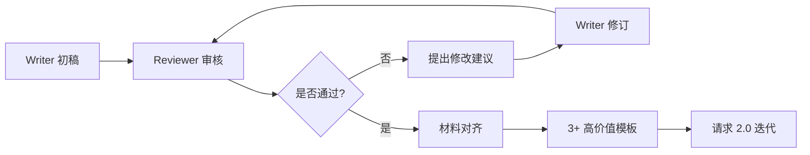

# 🤖 Team Agent Skill Builder v2.0

## 🎯 系统目标

本 Skill 实现了一套完整的 **Agent Team 协作框架**，用于创建高质量、结构化的 Skills。通过 Writer Agent 和 Reviewer Agent 的迭代协作，确保每个 Skill 都经过严格的质量把关和持续优化。

## 📋 核心工作流程

### 阶段 1️⃣: 访谈阶段（输入收集）

在开始创建 Skill 之前，需要收集三类核心材料：

#### 📚 智能库（Intelligence Library）
- **短视频案例库** - 2-3 轮开放问答 + 智能整理 + 1-3 张可视化图表
- **广告故事库** - 收集相关领域的成功案例
- **实用性样例库** - 实际可用的模板和示例

**收集方式：**
```
🔹 转化式提问：不直接问需求，而是通过场景化问题引导
🔹 开放式对话：允许 2-3 轮深入探讨
🔹 实用性样例：收集真实案例而非理论描述
```

#### 🎨 材料库（Material Library）
- **智能库模板** - 结构化的知识组织方式
- **AI 插件模板** - 可复用的功能模块
- **用户目标** - 明确的使用场景和预期结果

#### 💬 群对话材料（Group Dialogue）
- **真实对话记录** - 捕捉用户的真实需求表达
- **痛点提炼** - 从对话中识别核心问题
- **风格化语言** - 保持用户熟悉的表达方式

---

### 阶段 2️⃣: 写作阶段（Agent Team 迭代协作）

这是核心创作阶段，采用 **Writer + Reviewer 双 Agent 模式**：

#### ✍️ Writer Agent（创作者）
**角色定位：** 内容生成 + 结构化输出

**核心职责：**
- 基于访谈材料生成初稿
- 应用 `proven_solutions` 和 `RPM` 框架（1000字内）
- 确保输出符合 SKILL.md 格式规范

**输出标准：**
```markdown
---
name: [Skill 名称]
description: [一句话描述核心价值]
---

# 🎯 系统目标
[明确的问题定义和解决方案]

# 🛠️ 核心工作流
[分步骤的执行流程]

# 📝 模板规范
[具体的使用指南]

# 📂 资源位置
[相关文件和示例链接]
```

#### 🔍 Reviewer Agent（审核者）
**角色定位：** 质量把关 + 迭代优化

**审核维度：**
1. **访谈深度** - 是否充分理解用户需求？
2. **结构完整性** - 是否包含所有必需板块？
3. **可执行性** - 步骤是否清晰可操作？
4. **资源完备性** - 模板和示例是否齐全？

**反馈机制：**
```
✅ 名人金句：引用权威观点强化论点
✅ 案例验证：用实际案例证明有效性
✅ 删减冗余：去除≤70s 的短视频内容
✅ 结构优化：确保逻辑清晰、层次分明
```

#### 🔄 迭代流程（最多 3 轮）



**迭代终止条件：**
- ✅ 已完成 3 轮迭代
- ✅ Reviewer 确认质量达标
- ✅ 包含 ≥3 个高价值模板

---

### 阶段 3️⃣: 自迭代系统（持续优化）

#### 📊 性能监控
- **使用方数据** - 追踪 Skill 的实际使用情况
- **发现瓶颈** - 识别流程中的卡点
- **优化迭代** - 基于反馈持续改进

#### 🎯 累积知识库
- **更新智能库** - 将新案例加入知识库
- **优化模板** - 根据实际使用效果调整
- **版本管理** - 记录每次迭代的改进点

---

## 🚀 使用指南

### 快速启动

1. **启动访谈模式**
```
请使用 Team Agent Skill Builder 帮我创建一个新的 Skill。
我的需求是：[描述你的场景和目标]
```

2. **Writer Agent 开始工作**
   - 自动收集智能库、材料库、群对话材料
   - 生成符合规范的初稿

3. **Reviewer Agent 介入**
   - 审核内容质量
   - 提出优化建议
   - 确认是否需要迭代

4. **迭代优化（最多 3 轮）**
   - Writer 根据反馈修订
   - Reviewer 再次审核
   - 直到达到发布标准

5. **输出交付**
   - 完整的 SKILL.md
   - 配套的模板文件
   - 实战示例文档

---

## 📐 质量标准

### ✅ 必须包含的元素

- [ ] YAML frontmatter（name + description）
- [ ] 系统目标（明确的问题定义）
- [ ] 核心工作流（分步骤执行指南）
- [ ] 模板规范（具体的使用说明）
- [ ] 资源位置（相关文件链接）
- [ ] 至少 3 个高价值模板或示例

### ✅ 内容质量要求

- [ ] 访谈深度充分（2-3 轮对话）
- [ ] 包含名人金句或权威引用
- [ ] 有实际案例验证
- [ ] 步骤清晰可执行
- [ ] 避免抽象术语，使用具象描述

### ✅ 迭代完成标准

- [ ] 通过 Reviewer 审核
- [ ] 完成最多 3 轮迭代
- [ ] 材料库对齐完成
- [ ] 用户确认可以发布

---

## 📂 资源位置

- **智能库模板**: [templates/intelligence_library.md](./templates/intelligence_library.md)
- **材料库模板**: [templates/material_library.md](./templates/material_library.md)
- **群对话模板**: [templates/dialogue_template.md](./templates/dialogue_template.md)
- **完整示例**: [examples/sample_skill_creation.md](./examples/sample_skill_creation.md)

---

## 🎓 最佳实践

### Writer Agent 注意事项
1. **避免"尽快"等模糊表述** - 使用具体的时间节点
2. **拒绝抽象动词** - 用"发送邮件"代替"对接"
3. **确保唯一责任人** - 每个任务只有一个 Owner
4. **5 分钟启动原则** - 下一步必须是立即可执行的小动作

### Reviewer Agent 审核重点
1. **检查清晰度** - 是否有模糊或歧义的表述？
2. **验证可执行性** - 用户能否直接按步骤操作？
3. **评估完整性** - 是否缺少关键信息或资源？
4. **确认价值** - 是否真正解决了用户的核心痛点？

---

## 🔧 进阶配置

### 自定义迭代次数
默认最多 3 轮迭代，可根据 Skill 复杂度调整：
- **简单 Skill**: 1-2 轮
- **中等复杂度**: 2-3 轮
- **高复杂度**: 3+ 轮（需用户确认）

### 集成外部工具
- **evolution-db.json**: 自动记录迭代历史
- **RPM 框架**: 控制 Writer 输出长度（≤1000 字）
- **proven_solutions**: 引用已验证的解决方案

---

## 📊 效果评估

### 成功指标
- ✅ Skill 创建时间 < 30 分钟
- ✅ 首次使用成功率 > 90%
- ✅ 用户满意度评分 > 4.5/5
- ✅ 迭代次数 ≤ 3 轮

### 持续改进
- 📈 收集用户反馈
- 📈 分析使用数据
- 📈 更新智能库
- 📈 优化模板库

---

**版本**: v2.0  
**最后更新**: 2026-02-09  
**维护者**: Team Agent System  
**反馈渠道**: evolution-db.json 自动记录 + RPM 框架迭代
