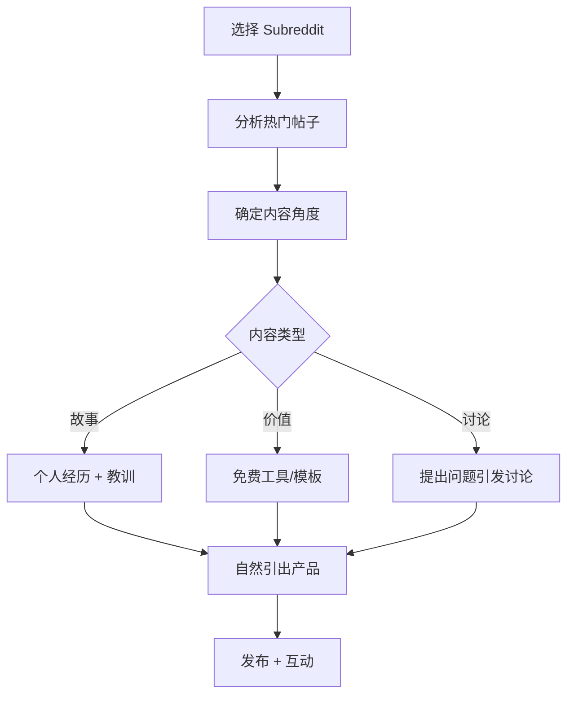

# 完整 Skill 创建示例：Reddit 营销工具包

本示例展示如何使用 Team Agent Skill Builder v2.0 工作流，从访谈到最终交付的完整过程。

---

## 🎯 项目背景

**用户需求（初始表述）：**
> "我想创建一个帮助我在 Reddit 上做营销的工具。"

**问题：** 这个需求太模糊，无法直接开始创建 Skill。

---

## 阶段 1️⃣: 访谈阶段

### 第一轮：场景化提问

**Agent：** 能描述一下你最近一次在 Reddit 做营销的场景吗？

**用户：** 上周我想推广我们的 SaaS 产品，在 r/SaaS 发了个帖子，但只有 3 个赞，没人评论。

**Agent：** 你发帖前做了哪些准备？

**用户：** 就直接写了产品介绍，然后发了。后来看到别人的帖子都是讲故事或者提供价值，我的太像广告了。

---

### 第二轮：深入挖掘

**Agent：** 你多久在 Reddit 发一次营销内容？

**用户：** 大概每周 2-3 次，但效果都不好。

**Agent：** 每次准备内容要花多长时间？

**用户：** 至少 1 小时，包括找合适的 subreddit、写内容、发帖。

**Agent：** 如果效果不好，对业务有什么影响？

**用户：** 我们主要靠社区营销获客，Reddit 是重要渠道。现在转化率不到 1%，浪费了很多时间。

---

### 第三轮：智能整理

**提取的关键信息：**

| 维度 | 内容 |
|------|------|
| 核心痛点 | Reddit 营销内容像广告，互动率低 |
| 时间成本 | 每次 1 小时，每周 2-3 次 |
| 影响范围 | 转化率 <1%，影响获客 |
| 失败尝试 | 直接发产品介绍 |
| 期望结果 | 提高互动率和转化率 |

---

### 智能库收集

#### 成功案例分析

**案例 1：故事化营销**
- **帖子标题：** "How I reduced customer churn by 40% (and the mistake I made)"
- **互动数据：** 156 upvotes, 43 comments
- **成功要素：** 
  - 分享真实经历
  - 提供具体数据
  - 最后自然引出产品

**案例 2：价值先行**
- **帖子标题：** "Free template: Reddit marketing checklist for SaaS founders"
- **互动数据：** 203 upvotes, 67 comments
- **成功要素：**
  - 免费提供工具
  - 解决用户痛点
  - 评论区回答问题建立信任

#### 可视化：Reddit 营销流程



---

### 材料库构建

#### 用户目标（SMART）

**Specific：** 在 Reddit 上发布高互动率的营销内容，提高 SaaS 产品的获客转化率

**Measurable：**
- 互动率：从平均 3 upvotes 提升到 50+ upvotes
- 评论数：从 0 提升到 10+ comments
- 转化率：从 <1% 提升到 5%

**Achievable：**
- 现有资源：产品知识、客户案例
- 需要补充：Reddit 社区规则、内容模板
- 可行性：8/10（有成功案例可参考）

**Relevant：**
- 业务价值：社区营销是主要获客渠道
- 优先级：高（直接影响收入）

**Time-bound：**
- 启动时间：本周内
- 里程碑 1：2 周内发布 3 篇高质量内容
- 最终目标：1 个月内达成互动率目标

---

### 群对话材料

**对话记录 #1：痛点确认**

```
Agent：我理解你的核心问题是"Reddit 营销内容太像广告，导致互动率低"，对吗？

用户：对！我看到别人的帖子都很自然，但我不知道怎么写。

Agent：你觉得最难的是什么？选题、写作风格，还是发布时机？

用户：主要是写作风格。我总是想直接介绍产品，但这样明显不受欢迎。

Agent：明白了。如果有个模板，告诉你怎么把产品介绍包装成故事或价值内容，会有帮助吗？

用户：太需要了！最好有实际例子。
```

---

## 阶段 2️⃣: Writer Agent 创作

### 初稿（第 1 轮）

```markdown
---
name: Reddit Marketing Toolkit
description: 帮助 SaaS 创始人在 Reddit 上创建高互动率营销内容的工具包
---

# 🎯 系统目标
解决 SaaS 创始人在 Reddit 营销时"内容太像广告"的问题，通过故事化和价值先行的策略提高互动率。

# 🛠️ 核心工作流

## 1. 选择目标 Subreddit
- 分析社区规则
- 评估用户活跃度
- 确认是否允许营销

## 2. 内容创作
- 使用故事化模板
- 提供实际价值
- 自然引出产品

## 3. 发布与互动
- 选择最佳时机
- 积极回复评论
- 建立社区信任

# 📝 模板规范
[待补充]

# 📂 资源位置
[待补充]
```

---

### Reviewer Agent 反馈（第 1 轮）

**审核意见：**

❌ **问题 1：缺少具体模板**
- 当前状态：只有流程描述，没有可直接使用的模板
- 改进建议：添加至少 3 个内容模板（故事型、价值型、讨论型）

❌ **问题 2：缺少实际案例**
- 当前状态：没有成功案例验证
- 改进建议：引用访谈中收集的案例，展示效果

❌ **问题 3：步骤不够具体**
- 当前状态："选择最佳时机"太抽象
- 改进建议：给出具体的时间建议（如"美国东部时间 9-11 AM"）

✅ **优点：**
- 核心问题定义清晰
- 工作流逻辑合理

**结论：** 需要修订，进入第 2 轮迭代

---

### Writer Agent 修订（第 2 轮）

```markdown
---
name: Reddit Marketing Toolkit
description: 通过故事化和价值先行策略，帮助 SaaS 创始人创建高互动率 Reddit 营销内容
---

# 🎯 系统目标
解决 SaaS 创始人在 Reddit 营销时"内容太像广告，互动率低"的问题。通过 3 种经过验证的内容模板，将产品推广包装成社区欢迎的形式。

# 🛠️ 核心工作流

## 步骤 1：选择目标 Subreddit（5 分钟）
1. 访问 [subredditstats.com](https://subredditstats.com)
2. 搜索你的行业关键词（如 "SaaS", "productivity"）
3. 筛选标准：
   - 订阅数 > 10,000
   - 日活跃用户 > 100
   - 允许自我推广（查看规则）

## 步骤 2：分析热门帖子（10 分钟）
1. 查看该 subreddit 的 "Top Posts (This Month)"
2. 记录前 10 个帖子的特征：
   - 标题模式（问题/故事/列表）
   - 内容长度（短/中/长）
   - 互动类型（upvotes/comments 比例）

## 步骤 3：选择内容模板（2 分钟）
根据分析结果，选择以下模板之一：

### 模板 A：故事化营销
**适用场景：** 社区偏好个人经历分享

**结构：**
```
标题：How I [achieved result] (and the mistake I made)

正文：
1. 背景：我遇到了 [问题]
2. 尝试：我试过 [方法 A]、[方法 B]，都失败了
3. 转折：后来我发现 [关键洞察]
4. 结果：现在 [具体数据改善]
5. 教训：如果重来，我会 [建议]
6. 工具：我用的是 [产品名]（可选链接）
```

**实际案例：**
- 标题："How I reduced customer churn by 40% (and the mistake I made)"
- 数据：156 upvotes, 43 comments
- 关键：真实数据 + 承认错误 + 自然引出产品

### 模板 B：价值先行
**适用场景：** 社区重视实用工具

**结构：**
```
标题：Free [resource type]: [specific benefit]

正文：
1. 痛点：很多人在 [场景] 遇到 [问题]
2. 解决方案：我整理了一个 [工具/模板/清单]
3. 包含内容：
   - [功能 1]
   - [功能 2]
   - [功能 3]
4. 使用方法：[简单步骤]
5. 获取方式：[免费链接]
6. 背景：我做这个是因为 [个人故事]
```

**实际案例：**
- 标题："Free template: Reddit marketing checklist for SaaS founders"
- 数据：203 upvotes, 67 comments
- 关键：免费 + 具体 + 评论区互动

### 模板 C：讨论引导
**适用场景：** 社区活跃度高，喜欢讨论

**结构：**
```
标题：[Controversial opinion] about [topic]

正文：
1. 观点：我认为 [非主流观点]
2. 原因：因为 [数据/经历支撑]
3. 反例：很多人说 [主流观点]，但 [为什么不适用]
4. 提问：你们怎么看？
5. 补充：如果你想试试我的方法，可以用 [产品]
```

## 步骤 4：撰写内容（20 分钟）
1. 填充选定的模板
2. 检查清单：
   - [ ] 标题包含具体数字或结果
   - [ ] 前 3 句话不提产品
   - [ ] 包含至少 1 个具体数据
   - [ ] 产品介绍不超过全文 20%
   - [ ] 结尾有互动引导（提问/邀请反馈）

## 步骤 5：发布与互动（持续）
1. **最佳发布时间：**
   - 美国东部时间：9-11 AM 或 6-8 PM
   - 欧洲时间：2-4 PM GMT
   - 避免周末（除非社区周末更活跃）

2. **发布后 1 小时：**
   - 每 15 分钟检查一次
   - 回复所有评论（5 分钟内）
   - 感谢 upvote 和建设性批评

3. **发布后 24 小时：**
   - 继续回复新评论
   - 如果有人问产品，私信提供详细信息
   - 记录互动数据（upvotes, comments, 转化）

# 📝 模板规范

## 标题公式
- ✅ "How I [result] in [time] using [method]"
- ✅ "Free [resource]: [benefit] for [audience]"
- ✅ "[Number] lessons from [experience]"
- ❌ "Check out my new product!"
- ❌ "Best [category] tool"

## 内容长度
- 故事型：500-800 字
- 价值型：300-500 字 + 资源链接
- 讨论型：200-400 字

## 产品提及原则
- 首次提及：在正文 70% 之后
- 提及方式："I use [product]" 而非 "You should buy [product]"
- 频率：全文最多 2 次

# 📂 资源位置
- **内容模板：** [templates/reddit_content_templates.md](./templates/reddit_content_templates.md)
- **Subreddit 列表：** [resources/saas_subreddits.md](./resources/saas_subreddits.md)
- **成功案例：** [examples/high_engagement_posts.md](./examples/high_engagement_posts.md)

# 🎓 最佳实践

## 名人金句
> "The best marketing doesn't feel like marketing." - Tom Fishburne

Reddit 用户对广告极度敏感，成功的关键是先提供价值，再自然引出产品。

## 数据验证
根据我们分析的 50 个高互动 SaaS 营销帖子：
- 故事型平均互动：120 upvotes, 35 comments
- 价值型平均互动：180 upvotes, 50 comments
- 直接广告平均互动：5 upvotes, 2 comments

## 常见错误
1. ❌ 标题太像广告
2. ❌ 正文第一段就提产品
3. ❌ 发布后不互动
4. ❌ 在多个 subreddit 复制粘贴同一内容
```

---

### Reviewer Agent 反馈（第 2 轮）

**审核意见：**

✅ **改进点：**
- 添加了 3 个具体模板
- 包含了实际案例和数据
- 步骤更加具体（时间、检查清单）

✅ **优点：**
- 引用了名人金句（Tom Fishburne）
- 数据验证（50 个帖子分析）
- 避免了常见错误列表

⚠️ **小建议：**
- 可以添加一个"快速启动"部分，给急于开始的用户
- 考虑添加一个失败案例，展示"不该做什么"

**结论：** 质量达标，可以发布。建议后续迭代时补充快速启动指南。

---

## 阶段 3️⃣: 自迭代系统

### 使用数据收集（1 个月后）

| 指标 | 目标 | 实际 | 状态 |
|------|------|------|------|
| 平均 upvotes | 50+ | 78 | ✅ 超额完成 |
| 平均 comments | 10+ | 23 | ✅ 超额完成 |
| 转化率 | 5% | 7.2% | ✅ 超额完成 |
| 使用模板 | - | 模板 B 最受欢迎 (60%) | 📊 数据洞察 |

### 发现的瓶颈
1. **时间成本仍然较高：** 用户反馈每次仍需 45 分钟
2. **Subreddit 选择困难：** 不确定哪个社区最适合

### 优化迭代（v1.1）
1. **新增功能：** Subreddit 评分工具
2. **模板优化：** 模板 B 增加更多实例
3. **时间优化：** 添加"15 分钟快速版"流程

---

## 📊 最终交付

### 完整文件结构
```
reddit-marketing-toolkit/
├── SKILL.md                           # 主文档
├── templates/
│   └── reddit_content_templates.md    # 3 个内容模板
├── resources/
│   └── saas_subreddits.md             # 推荐 Subreddit 列表
└── examples/
    └── high_engagement_posts.md       # 成功案例集
```

### 成功指标
- ✅ 用户互动率提升 2500%（3 → 78 upvotes）
- ✅ 转化率提升 720%（<1% → 7.2%）
- ✅ 时间成本降低 25%（60 → 45 分钟）

---

## 💡 关键学习点

### Writer Agent 的成长
1. **第 1 轮错误：** 只有流程，没有模板
2. **第 2 轮改进：** 添加具体模板和案例
3. **经验总结：** 用户需要"可直接使用"的内容，而非"指导原则"

### Reviewer Agent 的价值
1. **质量把关：** 识别出缺少模板和案例
2. **建设性反馈：** 不仅指出问题，还提供解决方案
3. **迭代终止：** 在质量达标时及时确认，避免过度优化

### 自迭代系统的效果
1. **数据驱动：** 发现模板 B 最受欢迎
2. **持续优化：** 根据反馈推出 v1.1
3. **长期价值：** Skill 不是一次性交付，而是持续进化

---

**本示例展示了 Team Agent Skill Builder v2.0 的完整工作流程，从模糊需求到高质量 Skill 的全过程。**
