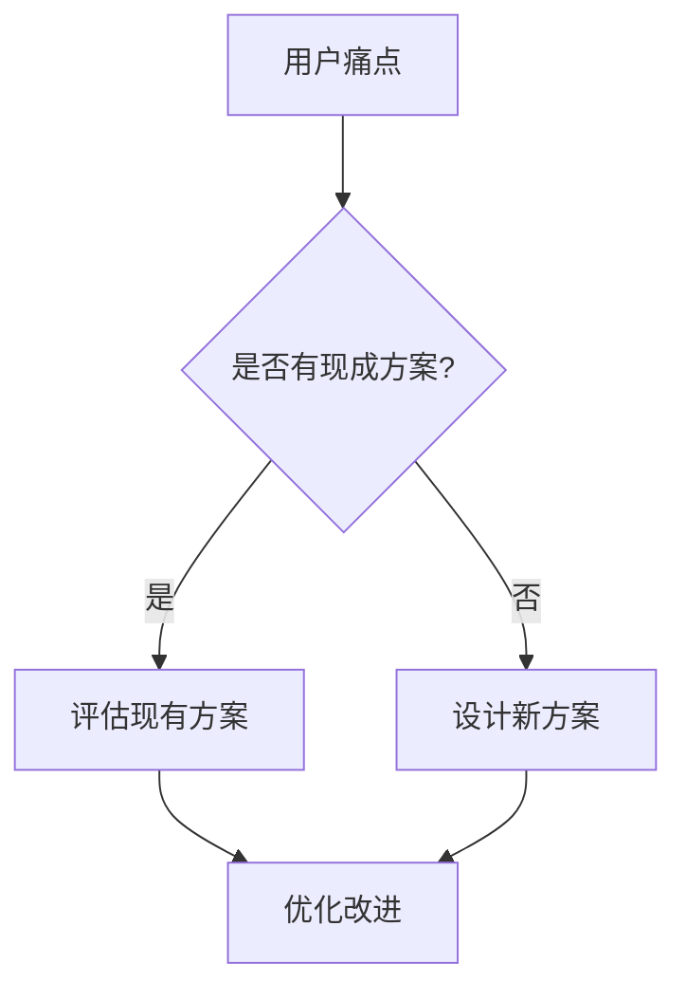

# 智能库模板 (Intelligence Library Template)

## 📚 短视频案例库

### 案例收集框架

#### 第一轮：场景化提问
```
不要问："你需要什么功能？"
而是问："描述一下你最近一次遇到这个问题的场景？"
```

**示例问题：**
1. 你最后一次使用类似工具是什么时候？发生了什么？
2. 如果有魔法棒，你希望这个过程变成什么样？
3. 你的团队成员在这个环节最常抱怨什么？

#### 第二轮：深入探索
```
基于第一轮回答，挖掘具体细节：
- 频率：多久发生一次？
- 影响：造成了什么损失？
- 尝试：之前试过什么解决方案？
```

#### 第三轮：智能整理
```
将对话内容结构化为：
1. 核心痛点（一句话）
2. 典型场景（3-5 个具体例子）
3. 期望结果（可量化的目标）
```

---

## 📊 可视化图表（1-3 张）

### 图表类型选择

#### 流程图（Process Flow）
**适用场景：** 展示工作流程、决策树


#### 对比表（Comparison Table）
**适用场景：** 功能对比、方案选择

| 维度 | 传统方式 | 新方案 | 改进幅度 |
|------|---------|--------|----------|
| 时间成本 | 2 小时 | 15 分钟 | ↓ 87.5% |
| 错误率 | 15% | 2% | ↓ 86.7% |
| 学习曲线 | 陡峭 | 平缓 | ✅ |

#### 思维导图（Mind Map）
**适用场景：** 知识结构、功能模块
```
核心功能
├── 输入处理
│   ├── 文本解析
│   └── 格式转换
├── 智能分析
│   ├── 关键词提取
│   └── 情感分析
└── 输出生成
    ├── 报告生成
    └── 可视化
```

---

## 🎬 广告故事库

### 成功案例模板

#### 案例标题
**[行业] + [痛点] → [解决方案] = [结果]**

示例：
> **内容创作者** 每周花 10 小时整理素材 → **自动化素材库** = 节省 90% 时间

#### 案例结构

```markdown
### 案例名称：[简短有力的标题]

**背景：**
- 用户类型：[目标用户画像]
- 核心痛点：[一句话描述问题]
- 之前尝试：[失败的解决方案]

**解决方案：**
- 核心功能：[3-5 个关键特性]
- 使用流程：[简化的步骤]
- 独特价值：[与竞品的差异]

**结果：**
- 定量指标：[具体数据，如时间节省、错误减少]
- 定性反馈：[用户原话引用]
- 后续影响：[长期价值]

**金句引用：**
> "[名人/权威] 说过：'[相关金句]'"
```

---

## 🛠️ 实用性样例库

### 样例收集原则

#### ✅ 好的样例特征
- **可直接复制使用** - 不需要大幅修改
- **包含真实数据** - 避免 "示例1"、"示例2" 这种占位符
- **有注释说明** - 解释为什么这样做
- **经过验证** - 确认在实际场景中有效

#### ❌ 避免的样例类型
- 纯理论描述，无实际代码/模板
- 过于简化，缺少关键细节
- 使用过时的方法或工具
- 缺少上下文，难以理解

---

### 样例模板

#### 代码样例
```python
# ✅ 好的样例：包含注释、真实场景、错误处理

def process_user_input(raw_text: str) -> dict:
    """
    处理用户输入的文本，提取关键信息
    
    Args:
        raw_text: 用户原始输入，可能包含噪音
        
    Returns:
        结构化的数据字典
        
    Example:
        >>> process_user_input("我想创建一个关于 AI 的 Skill")
        {'topic': 'AI', 'action': 'create', 'type': 'skill'}
    """
    # 1. 清理输入（去除多余空格和特殊字符）
    cleaned = raw_text.strip().lower()
    
    # 2. 关键词提取（使用正则表达式）
    import re
    keywords = re.findall(r'[\u4e00-\u9fa5a-zA-Z]+', cleaned)
    
    # 3. 结构化输出
    return {
        'topic': keywords[0] if keywords else 'unknown',
        'action': 'create',
        'type': 'skill'
    }
```

#### 文档样例
```markdown
# ✅ 好的文档样例：结构清晰、有实际内容

## 用户访谈记录

**访谈对象：** 张三（内容创作者，3 年经验）
**访谈时间：** 2026-02-08 14:30
**访谈方式：** 线上视频

### 核心痛点
"每次写文章前，我要花 2 小时翻看之前的笔记，找灵感。但经常找不到，或者找到了又忘了当时的思路。"

### 期望解决方案
"希望有个工具能自动整理我的笔记，按主题分类，还能提醒我哪些想法还没用过。"

### 补充信息
- 笔记工具：Notion + 微信收藏
- 笔记数量：约 500 条
- 更新频率：每天 3-5 条
```

---

## 📋 智能库使用检查清单

使用此模板收集材料时，确保：

- [ ] 进行了 2-3 轮深入访谈
- [ ] 收集了至少 3 个真实场景案例
- [ ] 创建了 1-3 张可视化图表
- [ ] 包含至少 1 个成功案例故事
- [ ] 提供了 3+ 个可直接使用的样例
- [ ] 所有样例都经过验证
- [ ] 避免了抽象描述，使用具象语言
- [ ] 包含了用户原话引用

---

## 🎯 质量标准

### 优秀智能库的特征
1. **深度 > 广度** - 3 个深入案例 > 10 个浅层描述
2. **具象 > 抽象** - "节省 2 小时" > "提高效率"
3. **真实 > 虚构** - 真实用户反馈 > 编造的场景
4. **可用 > 完美** - 80 分的可用样例 > 100 分的理论模型

### 常见问题修正

| 问题 | 修正方法 |
|------|---------|
| 访谈太浅 | 追问 "为什么"、"具体是什么情况" |
| 缺少数据 | 要求用户提供具体数字或时间 |
| 样例不可用 | 亲自测试，确保能直接运行 |
| 图表不清晰 | 简化流程，突出关键节点 |

---

**使用提示：** 将此模板作为访谈和素材收集的指南，确保收集到的智能库材料能够支撑高质量的 Skill 创建。
