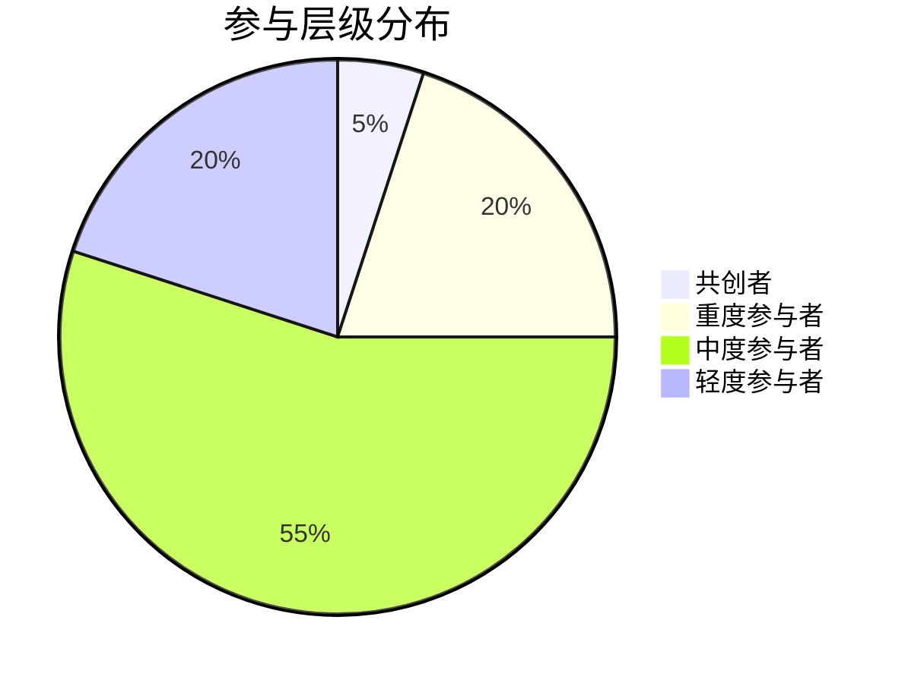

# 📊 复利日知录社群运营分析报告

## 一、整体健康度

### 活跃度趋势

从1月10日到1月15日，社群活跃度呈现一个波动下降的趋势。
- **高峰:** 1月13日，达到210条消息。
- **低谷:** 1月15日，仅有52条消息。
- **分析:** 活跃度在前期较高，可能受到特定话题或活动的驱动。后期活跃度逐渐下降，可能需要新的刺激或活动来维持用户参与。需要关注1月15日活跃度骤降的原因，是否是周末效应，还是其他事件导致。

### 参与层级分布

*数据基于提供的数据得出，可能与实际情况存在误差。*

* 共创者: 6人
* 重度参与者: 23人
* 中度参与者: 64人
* 轻度参与者: 暂无数据
* 沉默用户: 暂无数据
* 流失用户: 暂无数据

可以大致估计参与层级占比(粗略估计，因为轻度和沉默用户无数据)：

*   **共创者:** 5%
*   **重度参与者:** 20%
*   **中度参与者:** 55%
*   **轻度参与者:** 20% (粗略估计，用于计算健康度)

**参与层级分布 (饼图):**

### 健康度评分

**健康度评分：70/100**

**理由:**

*   **优点:**
    *   社群存在一定数量的共创者和重度参与者，他们是社群活跃的中坚力量。
    *   中度参与者占比高，说明社群内容对一部分用户具有吸引力。
*   **缺点:**
    *   活跃度呈下降趋势，存在流失风险。
    *   缺乏轻度参与者和沉默用户的数据，无法有效评估潜在的用户增长空间。
    *   活跃度波动较大，需要稳定活跃度的措施。

## 二、用户画像分析

### 共创者特征

*   **共同特点:** 高频活跃，乐于分享，主动发起话题，积极回应他人，具有较强的连接能力。
*   **互动模式:** 围绕日知录内容进行深度讨论，分享个人实践经验，互相提供支持和反馈。
*   **贡献方向:** 内容共创 (分享知识、经验、观点)，活跃气氛 (积极互动、回应)，组织协调 (发起话题、活动)。
*   **典型代表:** 成甲、王佼、夏夏、Airly 等。

### 用户性格分类

*   **成甲:**  知识分享者、引导者 (提供核心知识框架，引导讨论方向)。
*   **王佼:**  连接者、实践派 (连接社群成员，积极参与 Show Your Work)。
*   **夏夏:**  推动者、监督者 (推动成员完成学习任务，提供反馈和建议)。
*   **Airly:**  活跃者、支持者 (积极参与讨论，提供支持和鼓励)。
*   **土豆仔/土豆爱学习:** 共创者、实践者 (主动参与日知录共创，分享实践成果)。
*   **一鹏（Superone）:**  学习者、实践者 (积极学习并实践日知录内容，分享成果)。

## 三、激活策略

### 沉默用户激活

*   **问题:** 缺乏沉默用户数据，无法进行精准画像和分析。
*   **建议:**
    1.  **增加数据收集:** 通过问卷调查、用户分层标签、埋点等方式，收集沉默用户的基本信息和行为数据。
    2.  **通用激活策略:**
        *   **发起投票/小调查:**  围绕日知录内容、社群运营等话题，发起简单易参与的投票/小调查，降低参与门槛。
        *   **话题征集:**  邀请沉默用户提出感兴趣的话题，满足他们的需求。
        *   **定向邀请:**  针对性地邀请沉默用户参与感兴趣的话题讨论，或提供个性化的学习资源。
        *   **内容精简:** 保证推送的内容简洁高效，能够快速抓住用户的眼球。

### 流失用户召回

*   **分析:** 暂时没有流失用户的数据，后续如果出现，则需要关注：
    *   **流失原因:**  通过私聊、问卷调查等方式，了解流失用户的离开原因。
    *   **召回策略:**  针对流失原因，制定个性化的召回策略。例如，如果是因为内容质量下降，则需要提升内容质量；如果是因为时间冲突，则可以提供异步学习资源。

### 轻度用户转化

*   **策略:**
    1.  **提供价值:**  持续输出高质量、有价值的内容，吸引轻度用户的关注。
    2.  **降低参与门槛:**  鼓励轻度用户参与简单的互动活动，例如点赞、评论、投票等。
    3.  **创造归属感:**  营造积极、友好的社群氛围，让轻度用户感受到归属感。
    4.  **榜样激励:**  分享重度参与者的学习经验和成果，激励轻度用户积极参与。
    5. **Show Your Work:** 引导轻度用户分享他们的实践成果，并给予积极的反馈。

## 四、话题运营建议

### 受欢迎话题

*   **日知录内容解读与讨论:**  围绕成甲老师的日知录文章进行解读、讨论、分享实践经验，是社群的核心话题。
*   **Show Your Work:**  分享个人实践成果，获得反馈和支持。
*   **个人成长与思考:**  分享个人学习、工作、生活中的感悟和思考。
*   **工具推荐与使用:**  分享高效的学习工具、生产力工具，例如Notebook LM等。

### 话题增加建议

*   **案例分析:**  增加对日知录知识点进行实际案例的分析，帮助成员更好地理解和应用。
*   **问题解答:**  设置专门的提问和解答环节，解决成员在学习和实践中遇到的问题。
*   **主题活动:**  定期组织主题活动，例如读书会、知识分享会、实践挑战赛等，增强社群的互动性和凝聚力。
*   **跨界交流:**  邀请其他领域的专家或优秀人士进行分享，拓展社群成员的视野。

## 五、运营行动清单

1.  **完善用户画像:**  收集轻度用户和沉默用户的数据，进行用户分层和画像分析。
2.  **优化内容输出:**  持续输出高质量、有价值的内容，并根据用户反馈进行优化。
3.  **组织互动活动:**  定期组织主题活动，增加社群的互动性和凝聚力。
4.  **激励用户参与:**  建立激励机制，鼓励用户积极参与讨论和分享。
5.  **维护社群氛围:**  营造积极、友好的社群氛围，鼓励用户互相支持和帮助。
6.  **分析活跃度下降原因:** 深入分析近期的活跃度下降原因，并采取相应措施。
7.  **尝试新的话题方向:**  围绕个人成长、技能提升、职业发展等话题，探索新的内容方向。
8.  **优化社群规则:**  定期回顾和优化社群规则，确保社群的健康发展。
9.  **针对性召回:** 尝试对流失用户进行分析，针对性地进行召回，例如可以询问是否是因为内容质量下降。
10. **鼓励共创:** 鼓励更多成员参与到社群的内容共创中，例如，可以发起每日记录的讨论，确定记录形式和内容分类。

---
*生成时间: 2026-01-15*
